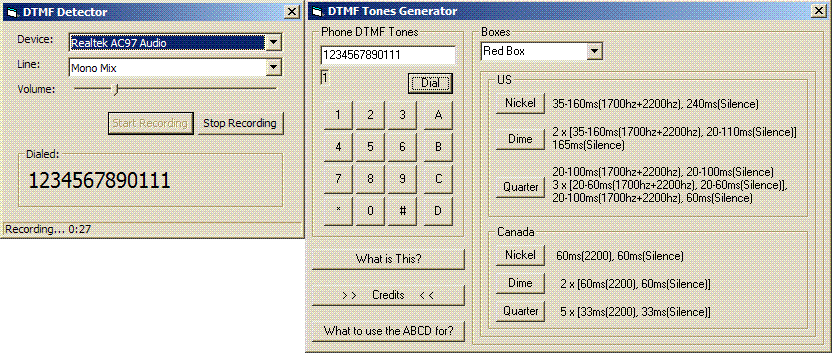



## DTMF detection

### Description

A little experiment on how to detect DTMF in a PCM signal.

Uses my WaveIn recorder class and the DTMF tone generator of Bobbek (codeid 64048).

With the DTMF tone generator you play some tones,

and with the DTMF detector you catch them.

In order for this work you have to select the correct mixer line (mostly "mono/stereo mix" or "waveout") and you have to find out for which volume it works best.

On my computer the mixer line volume has to be about 20%.
 
### More Info
 

             |
---                |---
**Submitted On**   |2004-11-19 19:39:14
**By**             |[Arne Elster](https://github.com/Planet-Source-Code/PSCIndex/blob/master/ByAuthor/arne-elster.md)
**Level**          |Advanced
**User Rating**    |5.0 (45 globes from 9 users)
**Compatibility**  |VB 6\.0
**Category**       |[Sound/MP3](https://github.com/Planet-Source-Code/PSCIndex/blob/master/ByCategory/sound-mp3__1-45.md)
**World**          |[Visual Basic](https://github.com/Planet-Source-Code/PSCIndex/blob/master/ByWorld/visual-basic.md)
**Archive File**   |[DTMF\_detec20367512102006\.zip](https://github.com/Planet-Source-Code/arne-elster-dtmf-detection__1-67338/archive/master.zip)

